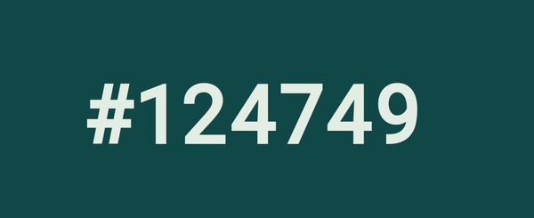

# Time as color
Displays the current time as hex color. The background changes to that color.



Made with svelte just for the lulz


## Run the app

### Install npm packages
```
npm install
```
### Run development server
```
npm run dev
```